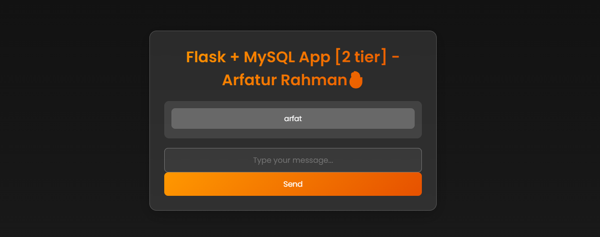

# Docker Networking Example: Running MySQL and Flask in the Same Network

## 📝 Summary

This guide explains how to:

- Create a custom Docker network.
- Build a Docker image for a Flask REST API.
- Run both a MySQL database and a Flask application within the same Docker network.
- Enable communication between containers using Docker's network system.

This is useful for **multi-container applications** where containers (like a backend API and a database) need to communicate securely and efficiently.

## 🔗 Docker Networks Explained

Docker networks allow containers to communicate with each other. The most common network drivers are:

- **bridge** (default for user-defined networks): Provides isolated networking for containers.
- **host**: Shares the host’s network stack (not recommended for multi-container apps).
- **none**: No networking.

By default, containers on the same **user-defined bridge network** can communicate using container names.

### Key Benefits of Custom Networks:

- Easy inter-container communication via names.
- Better isolation and security.
- Control over IP addressing and DNS resolution.

## 📜 Step-by-Step Instructions

### Check Existing Docker Networks

```bash
docker network ls
```

This lists all Docker networks on your system.

### Create a Custom Docker Network

```bash
docker network create mynetwork -d bridge
```

- `mynetwork`: Custom name for the Docker network.
- `-d bridge`: Specifies the bridge driver (default and best for container communication).

### Clone the Project and Build the Flask Image

```bash
git clone https://github.com/arfat-xyz/learning-docker.git
cd learning-docker/two-tier-flask-app
ls  # Ensure Dockerfile exists
```

#### Build Docker Image for Flask App:

```bash
docker build -t two-tier-flask-app .
```

- `-t two-tier-flask-app`: Tags the image with the name for easy reference.
- `.`: Refers to the current directory (where Dockerfile exists).

### Verify Docker Images

```bash
docker images
```

Lists all locally available Docker images.

### Run MySQL Container in the Same Network

```bash
docker run -d \
  --name mysql2 \
  --network mynetwork \
  -e MYSQL_ROOT_PASSWORD=root \
  -e MYSQL_ROOT_USER=root \
  -e MYSQL_DATABASE=devops \
  mysql:latest
```

#### Breakdown:

- `-d`: Run in detached mode (in background).
- `--name mysql2`: Custom name for MySQL container.
- `--network mynetwork`: Ensures it’s in the same network as Flask.
- `-e`: Environment variables to configure MySQL.
  - `MYSQL_ROOT_PASSWORD`: Root password.
  - `MYSQL_DATABASE`: Creates a database named `devops`.
- `mysql:latest`: Pulls the latest MySQL image from Docker Hub.

### Run Flask Container in the Same Network

```bash
docker run -d \
  -p 3004:5000 \
  --network mynetwork \
  -e MYSQL_HOST=mysql2 \
  -e MYSQL_USER=root \
  -e MYSQL_PASSWORD=root \
  -e MYSQL_DB=devops \
  two-tier-flask-app
```

#### Breakdown:

- `-d`: Run in detached mode.
- `-p 3004:5000`: Maps port 5000 inside container to 3004 on host.
- `--network mynetwork`: Ensures same network as MySQL.
- `-e`: Passes environment variables to the Flask app.
  - `MYSQL_HOST`: Name of the MySQL container (Docker resolves this via DNS).
  - `MYSQL_USER`, `MYSQL_PASSWORD`, `MYSQL_DB`: MySQL connection credentials.
- `two-tier-flask-app`: Name of the Docker image created earlier.

### Check Running Containers

```bash
docker ps
```

Lists all currently running containers along with their port mappings.

### Access the Flask API

Open your browser or use Postman to access:

```
http://localhost:3004
```

Replace `localhost` with your server IP if running on a remote machine.

## ✅ Summary Recap:

| Step                | Command Summary                                       |
| ------------------- | ----------------------------------------------------- |
| Create network      | `docker network create mynetwork -d bridge`           |
| Build Flask image   | `docker build -t two-tier-flask-app .`                |
| Run MySQL container | `docker run -d --name mysql2 --network mynetwork ...` |
| Run Flask container | `docker run -d -p 3004:5000 --network mynetwork ...`  |
| View containers     | `docker ps`                                           |
